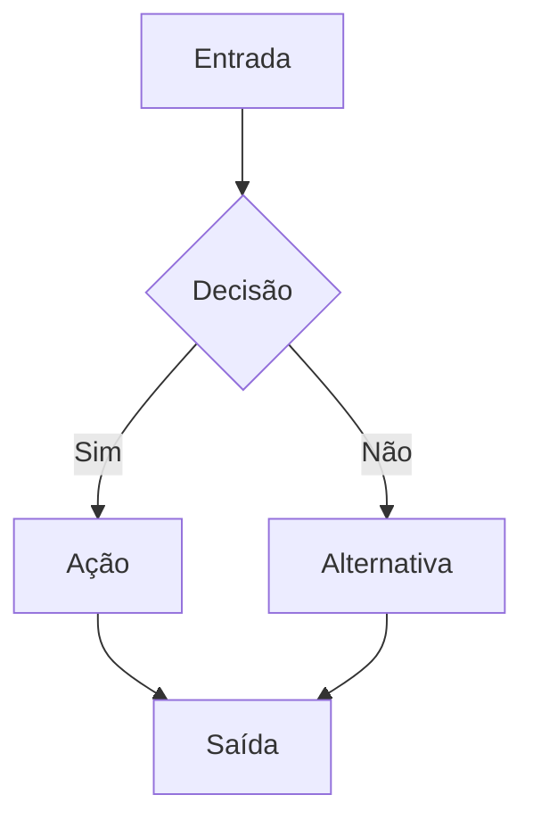

# Enterprise PM/PO/Scrum + Prompt Engineering (Enterprise)

## Objetivo

- Converter solicitação em plano verificável + prompts executáveis, com critérios de aceite, riscos, dependências e gates de qualidade.

## Entradas mínimas

- Solicitação do usuário (objetivo, restrições, prazo, stakeholders).
- Contexto do produto/repo (PRD, arquitetura, regras, padrões). Se existir `AGENTS.md`/`AI_RULES.md`/`README.agents.md`, tratar como obrigatório.

## Saídas padrão (quando aplicável)

1. Resumo executivo (1 parágrafo) + riscos principais.
2. Backlog (épicos → stories → tasks) com critérios de aceite.
3. Roadmap por milestones com dependências e critérios de “pronto”.
4. Prompts por papel (Dev/QA/Docs) curtos e objetivos.
5. Checklist de validação (DoD) com evidências.

## Workflow (usar em ordem)

### 1) Clarificar (se houver lacunas)

- Fazer no máximo 3 perguntas por rodada.
- Para cada pergunta, oferecer alternativas A/B/C/D neste formato:
  - Pergunta N
    A - (caminho recomendado, padrão enterprise)
       - Porque?
    B - (caminho viável)
       - Porque?
    C - (caminho viável)
       - Porque?
    D - Outro
       - Usuário descreve

### 2) Mapear impacto (Graph of Thoughts)

- Mapear nós: feature, páginas, componentes, rotas, APIs, dados, migrations, jobs, flags, observabilidade, testes.
- Mapear dependências (X → Y) e impactos em cascata (se mexer em X, o que quebra?).
- Listar riscos, pré-requisitos, e validações necessárias.
- Registrar no formato:
  - `Nós:` lista curta e nomeada
  - `Arestas:` X -> Y (dependência)
  - `Impactos:` o que precisa retestar/validar

### 3) Modelar fluxo (fluxograma)

- Descrever fluxo atual e fluxo desejado (quando houver UI/estado/múltiplos passos).
- Usar Mermaid como template (ajustar nomes conforme o domínio):

### 4) Definir artefatos (PM/PO)

- Definir: objetivo, métrica(s) de sucesso, não-objetivos, suposições, riscos, decisões, dependências.
- Definir critérios de aceite por story (testáveis/verificáveis).
- Usar skeletons em `references/artifacts.md` quando precisar velocidade e consistência.

### 5) Planejar execução (Scrum)

- Priorizar por valor, risco e dependências.
- Fatiar milestones em entregas verificáveis (com diffs e validação).
- Preparar plano de sprint (capacidade, sequenciamento, DoD).

### 6) Consultar documentação (Context7)

- Antes de especificar uso de bibliotecas/frameworks, resolver `libraryId` e consultar Context7 para padrões e exemplos.
- Usar Context7 também para tipagem/assinaturas e evitar `any` em TypeScript.

### 7) Gerar prompts (engenharia de prompts)

- Gerar prompts por papel usando `references/prompt-templates.md`.
- Regras para prompts curtos e com alta aderência:
  - Um objetivo por prompt (sem “listas de desejos”).
  - Contexto mínimo necessário (arquivos/rotas/ambiente) + nada de suposições ocultas.
  - Restrições explícitas (arquitetura, proibições, limites de arquivo, tokens de design).
  - Entregáveis verificáveis (diffs + paths + comandos rodados quando aplicável).
  - Validação obrigatória (lint/build/typecheck/test/console/manual QA conforme o caso).
  - Formato de resposta esperado (bullets curtos + links de arquivos + próximos passos).

### 8) Gate de qualidade (DoD)

- Exigir: zero erros/warnings em build/lint/typecheck/test quando aplicável.
- Exigir validação manual dos fluxos tocados (e console do navegador sem erros/warnings quando houver UI).
- Proibir regressões; remoções só com análise de impacto em cascata e validação.

## Checklist enterprise (incluir nos prompts quando aplicável)

- Escopo: `in-scope`, `out-of-scope`, “o que NÃO fazer”.
- Ownership: quem decide/aprova (RACI quando houver múltiplos stakeholders).
- Riscos e mitigação: top 3 riscos + plano de rollback/feature flag quando necessário.
- Observabilidade: logs/metrics/tracing quando fizer sentido.
- Segurança/privacidade/compliance: identificar dados sensíveis e controles.

## Checklist de engenharia (padrão TurnBold; priorizar regras do repo)

- SOLID + CRUD quando aplicável.
- TypeScript: proibido `any`.
- UI: usar apenas design tokens (`src/globals.css`, `styles/globals.css`, `tailwind.config.ts`); proibido CSS hardcoded.
- UI: responsivo (mobile/tablet/desktop) quando aplicável.
- Edge/Workers/Functions: específico por funcionalidade; modularizar conforme tamanho.
- TS/TSX/PY: modularizar para manter < 300 linhas por arquivo.
- SQL: sempre migrations + rollback antes de aplicar.
- Playwright: validação manual via MCP (scripts E2E só com autorização explícita).

## Referências

- Templates de prompts: `references/prompt-templates.md`.
- Skeletons de artefatos (PRD/roadmap/backlog/riscos): `references/artifacts.md`.
