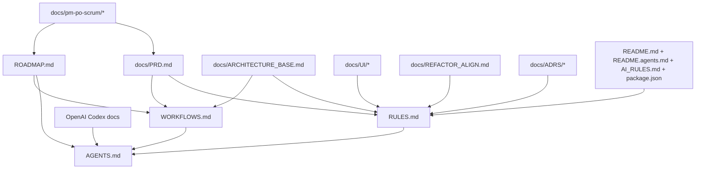
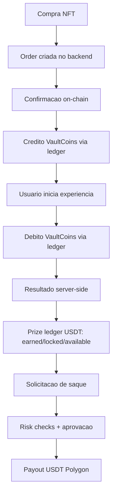

# PLAN - AGENTS + ECOSSISTEMA DE DOCUMENTACAO

Data: 2026-01-16
Status: Em execucao

## Objetivo
Gerar AGENTS.md (arquivo mestre) e documentacao complementar (RULES.md, WORKFLOWS.md, ROADMAP.md),
com base em todo o conteudo de /docs e nas referencias oficiais da OpenAI Codex.

## Escopo e fontes (resumo)
Fontes primarias:
1. docs/pm-po-scrum/chat-with-pm-po-scrum-1.md
2. docs/pm-po-scrum/chat-with-pm-po-scrum-2.md
3. docs/pm-po-scrum/chat-with-pm-po-scrum-3.md
4. docs/PRD.md
5. docs/ARCHITECTURE_BASE.md
6. docs/REFACTOR_ALIGN.md
7. docs/UI/*
8. docs/ROADMAP.md
9. docs/AGENT_PROMPTS.md
10. docs/TECHNICAL_IMPLEMENTATION_PLAN.md
11. docs/ADRS/ADR-0001-architecture-strategy.md
12. docs/ADRS/ADR-0002-ledger-first.md
13. docs/REFERENCES.md
14. README.md
15. README.agents.md
16. AI_RULES.md
17. package.json

Fontes externas (OpenAI Codex):
1. https://developers.openai.com/codex/prompting/
2. https://developers.openai.com/codex/guides/agents-md
3. https://developers.openai.com/codex/workflows

## Graph of Thoughts (nos e dependencias)

## Fluxograma (core loop do produto)

## Passos sequenciais (execucao)
1. Consolidar insumos e padroes do repo (docs + raiz).
2. Consolidar diretrizes oficiais da OpenAI Codex para AGENTS.md e prompting.
3. Definir estrutura do AGENTS.md (system message + secoes obrigatorias).
4. Redigir RULES.md consolidando regras tecnicas e de negocio.
5. Redigir WORKFLOWS.md (dev flow + operacionais do produto).
6. Redigir ROADMAP.md consolidando fases e backlog por prioridade.
7. Validar referencias cruzadas, coerencia e linguagem (pt-BR, ASCII).
8. Registrar pendencias de definicao e perguntas ao usuario.

## Milestones e diffs verificaveis
Milestone 1 - Planejamento estruturado
Diff esperado:
- +docs/PLAN-AGENTS.md

Milestone 2 - Documentos mestres criados
Diff esperado:
- +AGENTS.md
- +RULES.md
- +WORKFLOWS.md
- +ROADMAP.md

Milestone 3 - Ajustes finais
Diff esperado:
- Revisoes em AGENTS.md, RULES.md, WORKFLOWS.md, ROADMAP.md (se necessario)

## Checklist de regras inegociaveis (aplicacao)
- [x] Graph of Thoughts usado (neste arquivo).
- [x] Fluxograma usado (neste arquivo).
- [x] Padroes do projeto checados (docs/ + README/AI_RULES/README.agents).
- [x] Context7 consultado no planejamento (registro no log de execucao).
- [x] SOLID/CRUD considerados (em RULES.md quando aplicavel).
- [x] Proibido any (registrado em RULES.md).
- [x] Somente design tokens (registrado em RULES.md).
- [x] Responsivo (registrado em RULES.md).
- [x] Nao simplificar/regredir (registrado em RULES.md).
- [x] Edge functions por funcionalidade + limites (registrado em RULES.md).
- [x] Modularizacao > 300 linhas (registrado em RULES.md).
- [x] Zero erros/warnings build/lint/typecheck (registrado em WORKFLOWS.md).
- [x] Playwright MCP manual (registrado em WORKFLOWS.md; aplicavel quando ha UI/fluxo).
- [x] Migrations obrigatorias + rollback para SQL (registrado em RULES.md).
- [x] Sem solucao temporaria (registrado em RULES.md).
- [x] Perguntas de clarificacao listadas (ver secoes finais).

## Pendencias / duvidas a confirmar
1. Resolvido: documentacao complementar em /docs.
2. Resolvido: trunk-based + feature flags.
3. Resolvido (provisorio): nome padrao "Vault Market".
